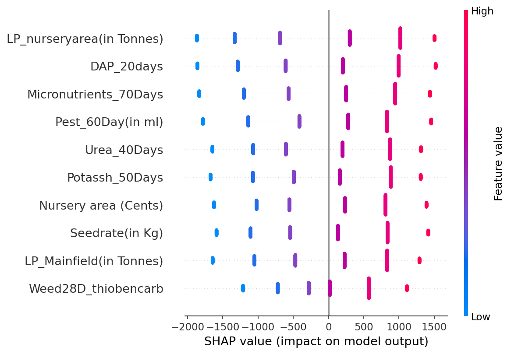
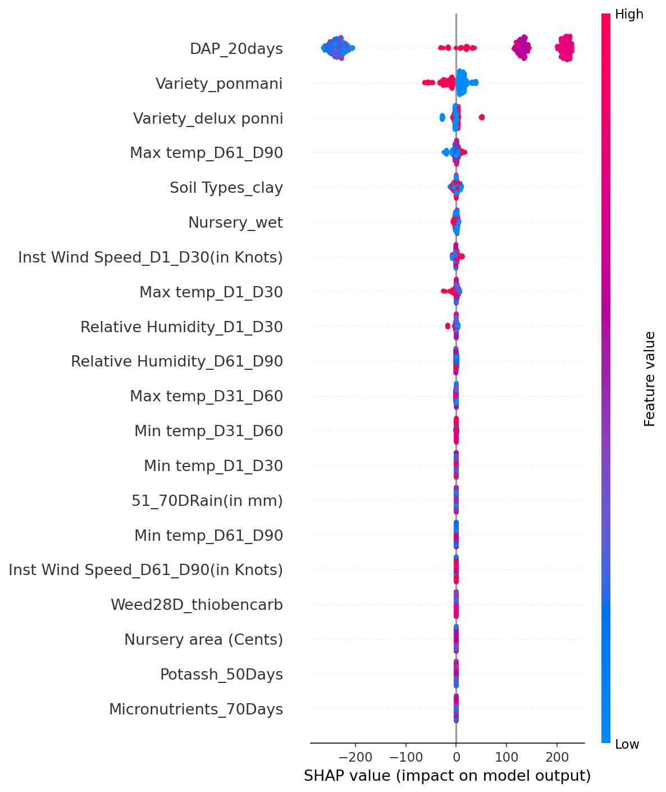

Set-Content -Path "README.md" -Encoding UTF8 -Value @'
# Paddy Yield Prediction

## Overview

This project builds regression models to predict paddy rice yield from agronomic and weather inputs recorded across real Tamil Nadu farms. Two target formulations are explored: total yield in kilograms and yield normalised to kilograms per hectare. The dataset is the [UCI Paddy Dataset (ID 1186)](https://datalab-12.ics.uci.edu/dataset/1186/paddy+dataset), collected in Tamil Nadu, India, and covers the full crop lifecycle with timed fertiliser, pesticide, and weather readings across four growth-stage windows. A Streamlit prediction app (`main.py`) serves the best total-yield model for interactive farm-level inference.

---

## Dataset

| Property | Value |
|---|---|
| Source | [UCI ML Repository — Paddy Dataset (ID 1186)](https://datalab-12.ics.uci.edu/dataset/1186/paddy+dataset) |
| Records | 2,789 |
| Predictors | 44 raw features |
| Target | `Paddy yield(in Kg)` (int64) |
| Missing values | None |

### Feature categories

**Farm & input features** — `Hectares`, `Agriblock`, `Variety` (3 varieties: CO43, delux ponni, ponmani), `Soil Types` (alluvial / clay), `Nursery` (dry / wet), `Seedrate(in Kg)`, `Nursery area (Cents)`, `LP_Mainfield(in Tonnes)`, `LP_nurseryarea(in Tonnes)`.

**Timed agronomic inputs** — applied at fixed days-after-planting intervals: `DAP_20days`, `Weed28D_thiobencarb`, `Urea_40Days`, `Potassh_50Days`, `Micronutrients_70Days`, `Pest_60Day(in ml)`, `Trash(in bundles)`.

**Weather across four growth-stage windows** (Days 1–30, 31–60, 61–90, 91–120) — rainfall (mm), supplemental irrigation (mm), minimum/maximum temperature (°C), instantaneous wind speed (knots), wind direction, and relative humidity (%).

### Target formulations

Two targets are used:

1. **Absolute yield — `Paddy yield(in Kg)`** — the raw per-farm harvest in kilograms. Range: 5,410–38,814 kg; mean ~22,518 kg; skew −0.32 (approximately symmetric, no log transform applied).

2. **Scale-normalised yield — `yield_per_hectare`** — computed as `Paddy yield(in Kg) / Hectares`. Range: 5,410–6,469 kg/ha; mean ~5,991 kg/ha; std 283 kg/ha.

The second target was introduced because the near-perfect R² (≈0.99) on the first target is largely driven by features that scale directly with farm size (`Hectares`). As noted in the notebook: *"The model is effectively learning 'bigger farm → more total output' through correlated proxies. This does not necessarily mean these inputs cause higher yield per unit area."* Normalising by hectares removes the size confound and reveals how well agronomic inputs predict productivity per unit land.

---

## Methodology

### Preprocessing (`notebooks/regression/02_data_preprocessing.ipynb`)

Starting from 2,789 rows × 44 features:

| Step | Detail |
|---|---|
| Feature type identification | 8 categorical (`object`), 18 integer (`int64`), 18 float (`float64`) |
| Categorical encoding | `OneHotEncoder(drop='first')` → 8 categorical columns expand to 27 OHE dummy columns |
| Post-encoding shape | (2,789, 63 features + target) |
| Scaling — tree models (`preprocessor_tree`) | Float features: `StandardScaler`; integer features: passthrough (no scaling) |
| Scaling — classic models (`preprocessor_all`) | Float and integer features: `StandardScaler`; categorical: OHE as above |

Two preprocessed files are exported:
- `data/transformed/paddy_preprocessed_tree.csv` — for Random Forest-based feature selection and tree model training
- `data/transformed/paddy_preprocessed.csv` — for linear/classic model training

Train-test split is performed in the feature selection notebooks: 80/20 (`random_state=42`), yielding 2,231 train rows and 558 test rows.

### Feature selection

A two-stage pipeline is applied independently for each target:

**Stage 1 — Pearson correlation filter**
OHE (binary) columns are excluded from the filter (Pearson is not meaningful for binary features) and added back unconditionally after filtering. Only continuous and integer numeric features are evaluated.

**Stage 2 — Random Forest MDI importance filter**
A `RandomForestRegressor(n_estimators=300, random_state=42)` is trained on the Pearson-filtered set. Features below the importance threshold are dropped.

#### Target 1: Absolute yield (`notebooks/regression/05_feature_selection(regr).ipynb`)

| Stage | Features |
|---|---|
| Start (after removing target, `Trash`, `Hectares`) | 61 |
| After Pearson filter (threshold ≥ 0.01): 34 numeric → 28 selected, plus 27 OHE columns re-added | 55 |
| After RF MDI filter (threshold ≥ 0.01) | **10** |

Final 10 selected features: `Micronutrients_70Days`, `LP_Mainfield(in Tonnes)`, `DAP_20days`, `LP_nurseryarea(in Tonnes)`, `Seedrate(in Kg)`, `Nursery area (Cents)`, `Pest_60Day(in ml)`, `Weed28D_thiobencarb`, `Urea_40Days`, `Potassh_50Days`.

All 10 are farmer-controlled agronomic inputs; no weather feature survived either filter for the absolute-yield target.

#### Target 2: Yield per hectare (`notebooks/regression/06_feature_selection(regr).ipynb`)

Additional columns removed before selection: `LP_nurseryarea(in Tonnes)`, `Hectares`, `Trash(in bundles)`, and the four supplemental irrigation columns (`30DAI`, `30_50DAI`, `51_70AI`, `71_105DAI`).

| Stage | Features |
|---|---|
| Start | 56 |
| After Pearson filter (threshold ≥ 0.01): 29 numeric → 24 selected, plus 27 OHE columns re-added | 51 |
| After RF MDI filter (threshold ≥ 0.003) | **24** |

Final 24 selected features include 9 agronomic inputs (`DAP_20days`, `Pest_60Day(in ml)`, `LP_Mainfield(in Tonnes)`, `Urea_40Days`, `Micronutrients_70Days`, `Potassh_50Days`, `Nursery area (Cents)`, `Weed28D_thiobencarb`, `Seedrate(in Kg)`), 4 variety/soil/nursery OHE dummies, and 11 weather features (temperature across multiple windows, relative humidity, wind speed, and rainfall).

### Models trained

**Target 1 — Absolute yield**

*Baseline (`model_training/05_baseline_traditional_models.ipynb`)*: Linear Regression, Ridge Regression, SVR — all tuned via `GridSearchCV` with 5-fold `KFold(shuffle=True, random_state=42)`.

*Advanced (`model_training/advanced_models_1.ipynb`)*: Random Forest — `GridSearchCV`, 5-fold CV, 216 parameter combinations (1,080 fits). Best parameters: `{max_depth: 10, max_features: 'sqrt', min_samples_leaf: 1, min_samples_split: 2, n_estimators: 300}`.

**Target 2 — Yield per hectare**

*Baseline (`model_training2/05_baseline_traditional_models.ipynb`)*: Linear Regression, Ridge Regression, SVR — 5-fold `GridSearchCV`.

*Advanced (`model_training2/advanced_models.ipynb`)*: Random Forest (108 candidates, 540 fits), XGBoost (36 candidates, 180 fits), LightGBM (108 candidates, 540 fits) — all 5-fold `GridSearchCV`.

---

## Results

All metrics are from the held-out test set (558 rows). CV metrics are 5-fold cross-validation on the training set.

### Target 1 — Absolute yield (kg)

| Model | CV R² | CV RMSE | CV MAE | Test R² | Test RMSE | Test MAE |
|---|---|---|---|---|---|---|
| Linear Regression | 0.9894 | 950.56 | 717.38 | 0.9889 | 948.75 | 709.03 |
| Ridge Regression (α=0.01) | 0.9894 | 950.56 | 717.38 | 0.9889 | 948.75 | 709.03 |
| SVR (C=10, ε=0.01, kernel=linear) | 0.9892 | 960.01 | 707.64 | 0.9886 | 963.63 | 705.55 |
| **Random Forest** (best) | — | — | — | **0.9911** | **850.46** | **593.32** |

Random Forest train metrics: R² 0.9919, RMSE 832.88, MAE 580.63.

### Target 2 — Yield per hectare (kg/ha)

| Model | CV R² | CV RMSE | CV MAE | Test R² | Test RMSE | Test MAE |
|---|---|---|---|---|---|---|
| Linear Regression | 0.3716 | 224.45 | 175.87 | 0.3706 | 223.35 | 174.35 |
| Ridge Regression (α=100) | 0.3720 | 224.38 | 175.86 | 0.3704 | 223.40 | 174.41 |
| SVR (C=100, ε=0.5, kernel=rbf) | 0.4996 | 200.35 | 147.59 | 0.4679 | 205.37 | 150.29 |
| Random Forest | — | — | — | 0.4642 | 206.08 | 160.16 |
| **XGBoost** (best) | — | — | — | **0.5119** | **196.70** | **152.98** |
| LightGBM | — | — | — | 0.5119 | 196.70 | 153.04 |

Random Forest per-hectare train metrics: R² 0.6106, RMSE 176.97, MAE 137.26. XGBoost train metrics: R² 0.5565, RMSE 188.86, MAE 146.99.

> **Key finding — R² gap between targets.** The absolute-yield model achieves Test R² ≈ 0.99; the per-hectare model peaks at Test R² ≈ 0.51. This gap is not a modelling failure — it is the central finding of the project. Once farm size is divided out, the agronomic features that powered the first model lose most of their explanatory value. The SHAP analysis (below) makes clear why: the first model was largely learning a scale relationship, while the second attempts to capture productivity efficiency, which is governed by a narrower set of inputs and substantial unobserved variation.

---

## SHAP Analysis

SHAP (SHapley Additive exPlanations) was applied using `shap.TreeExplainer` to the best-performing model for each target:

- **Total yield**: Random Forest (`models/random_forest_best.pkl`) evaluated on the 558-row test set.
- **Per-hectare yield**: XGBoost (`models[newtarget]/xgboost_best.pkl`) evaluated on the 558-row test set.

Summary plots are saved in `shap_analysis/`.

### Total yield — Random Forest SHAP



Top features by SHAP importance (ranked, from the notebook interpretation):

1. `LP_nurseryarea(in Tonnes)` — highest SHAP magnitude; higher values push predictions strongly upward
2. `DAP_20days` — second-largest driver; co-dominates with nursery preparation
3. `Micronutrients_70Days`
4. `Pest_60Day(in ml)`
5. `Urea_40Days`
6. `Potassh_50Days`
7. `Nursery area (Cents)`
8. `Seedrate(in Kg)`
9. `LP_Mainfield(in Tonnes)`
10. `Weed28D_thiobencarb` — smallest contribution

### Per-hectare yield — XGBoost SHAP



Top features by SHAP importance (ranked, from the notebook interpretation):

1. `DAP_20days` — overwhelmingly dominant; accounts for ~75% of total XGBoost gain. Higher DAP pushes per-hectare predictions strongly upward. Agronomically consistent with phosphorus' role in root development and early establishment.
2. `Variety_delux ponni` — binary OHE feature; two distinct SHAP clusters indicate meaningful variety-level productivity differences
3. `Variety_ponmani` — similarly, variety identity is a significant productivity lever
4. Remaining features (temperature, humidity, wind, other agronomic inputs) contribute marginally by comparison

### Interpretation

The SHAP results for the two targets tell a substantially different story. In the total-yield model, the top features — nursery preparation, DAP, seed rate, nursery area, main-field land preparation — are all quantities that scale proportionally with farm size. A 6-hectare farm uses roughly twice as much of everything as a 3-hectare farm, and the model learns this scale relationship, producing very high R² but limited insight into what makes a farm *productive per unit area*. In the per-hectare model, farm-size proxies are either excluded or lose explanatory power once yield is normalised, and DAP application rate and rice variety emerge as the meaningful drivers. This shift is consistent with the agronomic literature: phosphorus availability at early growth stages and inherent varietal yield potential are known determinants of rice productivity per hectare, independent of absolute farm scale. The moderate R² (≈0.51) of the per-hectare model reflects the limits of the available features — factors such as pest pressure, microclimate variation, and farm management skill are not captured in this dataset.

---

## Project Structure

```
Paddy_Prediction/
├── main.py                          # Streamlit prediction app (total-yield RF model)
├── requirements.txt                 # Pip-installable dependencies
├── pyproject.toml                   # Project metadata and pinned dependencies (requires Python >=3.12)
│
├── data/
│   ├── raw/                         # Original UCI CSV (not tracked by Git)
│   ├── transformed/                 # Preprocessed/OHE-encoded CSVs
│   ├── final/                       # Train/test splits for absolute-yield target (10 features)
│   ├── final2/                      # Train/test splits for per-hectare target (24 features)
│   └── dataset_description.md       # Feature descriptions and data types
│
├── notebooks/
│   ├── 01_data_exploration.ipynb    # EDA, target distribution, categorical summaries
│   ├── finding.txt                  # Key EDA finding: farm inputs dominate over weather
│   └── regression/
│       ├── 02_data_preprocessing.ipynb      # Encoding, scaling, export
│       ├── 04_checking_datasets.ipynb       # Sanity checks on preprocessed datasets
│       ├── 05_feature_selection(regr).ipynb # Feature selection — absolute yield target
│       └── 06_feature_selection(regr).ipynb # Feature selection — per-hectare target
│
├── model_training/                  # Absolute-yield target
│   ├── 05_baseline_traditional_models.ipynb # Linear Regression, Ridge, SVR
│   └── advanced_models_1.ipynb              # Random Forest + GridSearchCV + SHAP
│
├── model_training2/                 # Per-hectare target
│   ├── 05_baseline_traditional_models.ipynb # Linear Regression, Ridge, SVR
│   └── advanced_models.ipynb                # Random Forest, XGBoost, LightGBM + SHAP
│
├── models/                          # Saved models — absolute-yield target
│   ├── random_forest_best.pkl
│   ├── linear_regression.pkl
│   ├── ridge_regression.pkl
│   └── svr.pkl
│
├── models[newtarget]/               # Saved models — per-hectare target
│   ├── random_forest_best.pkl
│   ├── xgboost_best.pkl
│   ├── lightgbm_best.pkl
│   ├── linear_regression.pkl
│   ├── ridge_regression.pkl
│   └── svr.pkl
│
├── reports/                         # Visualisation outputs — absolute-yield target
│   ├── baseline_actual_vs_predicted.png
│   ├── baseline_metrics_comparison.png
│   └── baseline_residual_distributions.png
│
├── reports[newtarget]/              # Visualisation outputs — per-hectare target
│   ├── baseline_actual_vs_predicted.png
│   ├── baseline_metrics_comparison.png
│   └── baseline_residual_distributions.png
│
└── shap_analysis/
    ├── shap_total_yield_rf.png      # SHAP summary — RF on total yield
    └── shap_yield_per_hectare_xgb.png # SHAP summary — XGBoost on per-hectare yield
```

---

## How to Run

### Setup

This project uses [uv](https://github.com/astral-sh/uv) for dependency management. Alternatively, plain pip works against `requirements.txt`.

**Option A — uv (recommended)**
```bash
# Install uv if not already installed
pip install uv

# Create environment and install all dependencies
uv sync
```

**Option B — pip**
```bash
python -m venv .venv
# Windows
.venv\Scripts\activate
# macOS/Linux
source .venv/bin/activate

pip install -r requirements.txt
```

Python >=3.12 is required.

### Reproducing results

Run notebooks in this order:

```
1. notebooks/01_data_exploration.ipynb
2. notebooks/regression/02_data_preprocessing.ipynb
3. notebooks/regression/05_feature_selection(regr).ipynb   # absolute-yield target
4. notebooks/regression/06_feature_selection(regr).ipynb   # per-hectare target
5. model_training/05_baseline_traditional_models.ipynb      # absolute-yield baselines
6. model_training/advanced_models_1.ipynb                   # RF + SHAP (absolute yield)
7. model_training2/05_baseline_traditional_models.ipynb     # per-hectare baselines
8. model_training2/advanced_models.ipynb                    # RF/XGB/LGB + SHAP (per ha)
```

Steps 3 and 5–6 write to `data/final/` and `models/`; steps 4 and 7–8 write to `data/final2/` and `models[newtarget]/`. SHAP plots for both targets are written to `shap_analysis/`.

### Running the Streamlit app

The app uses the saved Random Forest model (`models/random_forest_best.pkl`) and requires only the 10 selected features for the absolute-yield target.

```bash
streamlit run main.py
```

The app accepts the 10 agronomic input values interactively and returns a predicted total paddy yield in kilograms.

### Dependencies (key versions from `pyproject.toml`)

| Package | Version |
|---|---|
| Python | >=3.12 |
| scikit-learn | >=1.8.0 |
| xgboost | >=3.2.0 |
| lightgbm | >=4.6.0 |
| shap | >=0.51.0 |
| pandas | >=2.2.0, <3 |
| numpy | >=2.4.3 |
| streamlit | >=1.23.0 |
'@
